# 🚀 Smart Notes API

<div align="center">

# 📝 Smart Notes API

### AI Powered Smart Notes Management REST API built with Spring Boot

<p align="center">


</p>

</div>

---

# 📖 Overview

Smart Notes API is an AI-powered REST API built using **Spring Boot** that helps users securely create, organize and manage their personal notes.

The application provides secure authentication using **JWT Access Token** and **Refresh Token**, allowing authenticated users to manage their notes safely.

Apart from standard CRUD operations, Smart Notes API integrates **Spring AI** to generate intelligent summaries, note titles and custom AI responses from user content.

Users can also upload PDF documents, automatically extract their text, generate AI-powered summaries, create AI-generated titles and download notes as PDF files.

The project follows a clean layered architecture and backend-first design. A frontend application can be integrated in the future to build a complete AI-powered Notes Management Platform.

The application uses **Neon PostgreSQL** as the database and **Swagger OpenAPI** for API documentation and testing.

---
---

# 🌐 Live Demo

## 🚀API Base URL

https://smart-notes-api-production.up.railway.app

---

## 📚 Swagger UI

https://smart-notes-api-production.up.railway.app/swagger-ui/index.html#/

---
# ✨ Features

## 🔐 Authentication

- User Registration
- Secure Login
- JWT Authentication
- Refresh Token
- Logout
- BCrypt Password Encryption
- Email Based Authentication

---

## 📝 Notes Management

- Create Note
- Update Note
- Delete Note
- Get Note By ID
- Get All Notes
- Search Notes
- Pagination
- Sorting
- Latest Notes
- My Notes

---

## 🤖 AI Features

- AI Title Generation
- AI Custom Prompt Summary
- AI-powered PDF Summary
- AI-powered PDF Title Generation

---

## 📄 PDF Features

- Upload PDF File
- Extract Text from PDF
- Generate AI Summary from PDF
- Generate AI-powered Title from PDF
- Download Note as PDF

---

## 🔒 Security

- Spring Security
- JWT Authentication
- Refresh Token Authentication
- Stateless Authentication
- JWT Protected REST APIs

---

# 🛠 Tech Stack

| Technology | Used |
|------------|------|
| Java 21 | ✅ |
| Spring Boot | ✅ |
| Spring AI | ✅ |
| Spring Security | ✅ |
| Spring Data JPA | ✅ |
| Hibernate | ✅ |
| PostgreSQL (Neon) | ✅ |
| JWT | ✅ |
| Maven | ✅ |
| Swagger OpenAPI | ✅ |
| Bean Validation | ✅ |
| iText PDF | ✅ |

---

# 🧩 Architecture

```text
Controller
      ↓
Service
      ↓
Repository
      ↓
PostgreSQL Database
```

---

# 🔑 Authentication

The project uses secure JWT Authentication.

Every protected endpoint requires:

```text
Authorization: Bearer YOUR_ACCESS_TOKEN
```

---

# 📡 REST API Documentation

## 🔐 Authentication APIs

| Method | Endpoint | Description |
|---------|----------|-------------|
| POST | `/auth/register` | Register a new user |
| POST | `/auth/login` | Login and receive Access Token + Refresh Token |
| POST | `/auth/refresh` | Generate a new Access Token |
| POST | `/auth/logout` | Logout and invalidate Refresh Token |

---

## 📝 Notes APIs

| Method | Endpoint | Description |
|---------|----------|-------------|
| POST | `/notes` | Create Note |
| GET | `/notes` | Get All Notes |
| GET | `/notes/{id}` | Get Note By ID |
| PUT | `/notes/{id}` | Update Note |
| DELETE | `/notes/{id}` | Delete Note |
| GET | `/notes/search/{title}` | Search Notes |
| GET | `/notes/pagination` | Pagination |
| GET | `/notes/pagination/sort` | Pagination & Sorting |
| GET | `/notes/sort` | Sort Notes |
| GET | `/notes/filter` | Filter Notes |
| GET | `/notes/latest` | Latest Notes |
| GET | `/notes/my-notes` | My Notes |
| POST | `/notes/upload` | Upload PDF & Generate Summary |
| GET | `/notes/download/{id}` | Download Note PDF |

---

## 🤖 AI APIs

| Method | Endpoint | Description |
|---------|----------|-------------|
| POST | `/ai/summarize` | Generate AI Summary |
| POST | `/ai/title` | Generate AI Titles |
| POST | `/ai/file-summary` | AI PDF Summary |
| POST | `/ai/file-title` | AI PDF Title Generation |

---
# 🛡 Security Features

The application follows Spring Security best practices to secure all protected endpoints.

Features included

- JWT Access Token Authentication
- Refresh Token Authentication
- BCrypt Password Encryption
- Spring Security Filter Chain Configuration
- Custom UserDetailsService
- Stateless Session Management
- Email Based Authentication
- Global Exception Handling
- Bean Validation
- Protected REST APIs

---

# 📂 Project Structure

```text
src
 ├── config
 ├── controller
 ├── dto
 │     ├── request
 │     └── response
 ├── entity
 ├── exception
 ├── repository
 ├── security
 │     ├── jwt
 │     └── UserDetails
 ├── service
 ├── util
 └── SmartNotesApiApplication
```

---

# 🗄 Database

The application uses **Neon PostgreSQL**.

Primary Tables

- users
- notes
- refresh_tokens

Relationships

```text
User
 │
 └────────< Notes

User
 │
 └────────< Refresh Tokens
```

---

# 🔄 Request Flow

```text
Client

   │

   ▼

Controller

   │

   ▼

Service

   │

   ▼

Repository

   │

   ▼

PostgreSQL Database
```

---

# 🧪 API Testing

The APIs have been tested using

- Swagger UI
- Browser (Swagger UI)
- Postman

All secured endpoints require a valid JWT Bearer Token.

---

# ⚙️ Getting Started

## 1️⃣ Clone Repository

```bash
git clone https://github.com/jeevan-kaware/smart-notes-api.git
```

```bash
cd smart-notes-api
```

---

## 2️⃣ Configure Database

Create a PostgreSQL database using Neon or Local PostgreSQL.

Update your **application.properties**

```properties
spring.datasource.url=<YOUR_DATABASE_URL>

spring.datasource.username=<YOUR_DATABASE_USERNAME>

spring.datasource.password=<YOUR_DATABASE_PASSWORD>
```

---

## 3️⃣ Configure JWT

```properties
jwt.secret=<YOUR_SECRET_KEY>

jwt.expiration=1800000

jwt.refresh-expiration=604800000
```

---

## 4️⃣ Configure Spring AI

```properties
spring.ai.openai.api-key=<YOUR_OPENAI_API_KEY>
```

---

## 5️⃣ Run the Project

Using Maven

```bash
./mvnw spring-boot:run
```

or

```bash
mvn spring-boot:run
```

---

# 📖 Open Swagger

Local

```text
http://localhost:8080/swagger-ui/index.html
```

---

# 📁 File Upload Support

Supported File Format

- PDF (.pdf)

Uploaded PDF Features

- Extract Text
- AI Summary
- AI Generated Title
- Save AI Summary as Note
- Download Note as PDF

---

# 🤖 AI Workflow

```text
Upload PDF

      │

      ▼

Extract PDF Text

      │

      ▼

Spring AI

      │

      ▼

Generate Summary

      │

      ▼

Generate AI Title

      │

      ▼

Save as Note
```

---

# 📄 PDF Features

The project supports complete PDF processing.

Available Features

- Upload PDF
- Read PDF Content
- Extract Text
- Generate AI Summary
- Generate AI Titles
- Download Notes as PDF

---

# 🌟 Highlights

- Clean Layered Architecture
- Email Based JWT Authentication
- Refresh Token Flow
- AI Powered Note Generation
- AI Powered PDF Summary
- AI Generated Titles
- Pagination
- Sorting
- Search
- PDF Download
- Swagger Documentation
- Bean Validation
- Exception Handling
- Production-ready Project Structure

---

# 🚀 Future Improvements

- React Frontend
- Docker Support
- Unit Testing
- Integration Testing
- Redis Cache
- CI/CD Pipeline
- Email Verification
- Note Sharing
- Image OCR Support
- Multi File Upload
- Voice Notes
- Markdown Notes

# 📸 Screenshots

The following screenshots demonstrate the complete workflow of the Smart Notes API.

---

## 🏠 Swagger Home

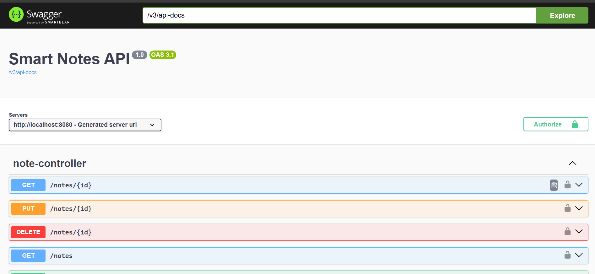

---

## 👤 User Registration


---

## 🔐 Login & JWT Token

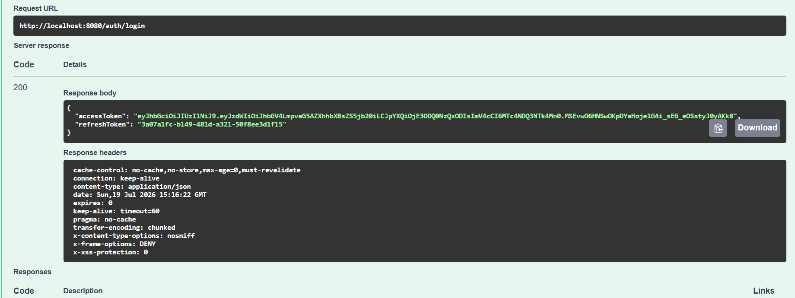

---

## 🔑 JWT Authorization

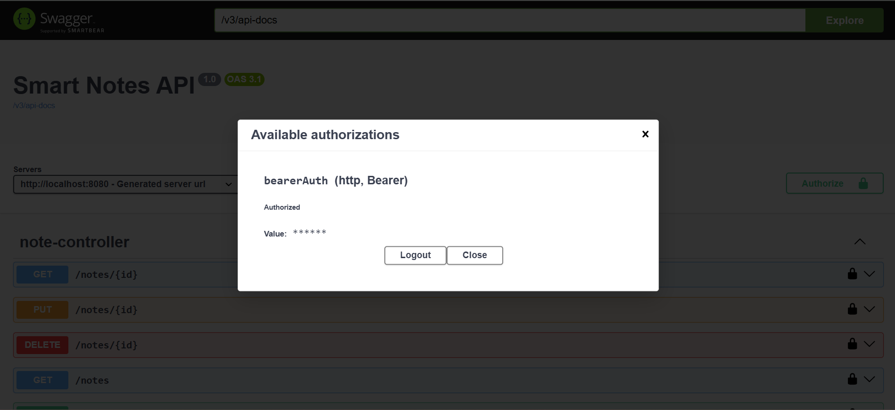

---

## 📝 Create Note

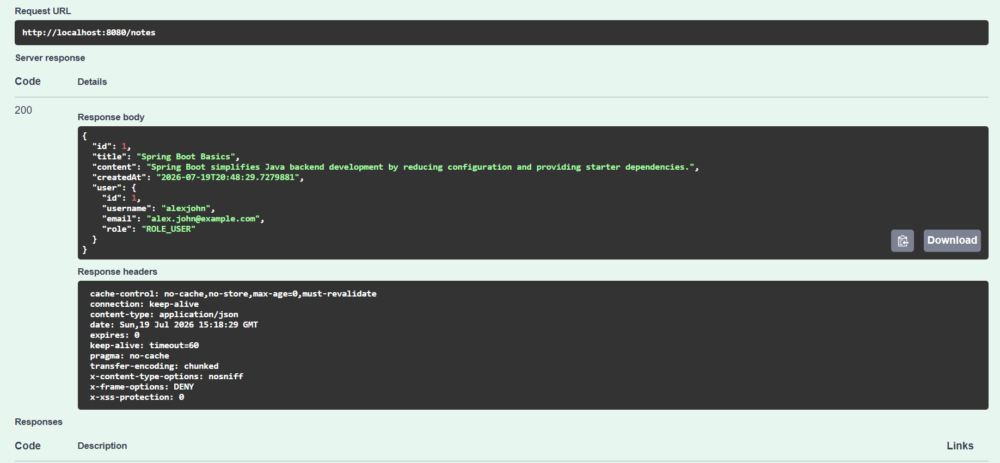

---

## 📚 Get All Notes

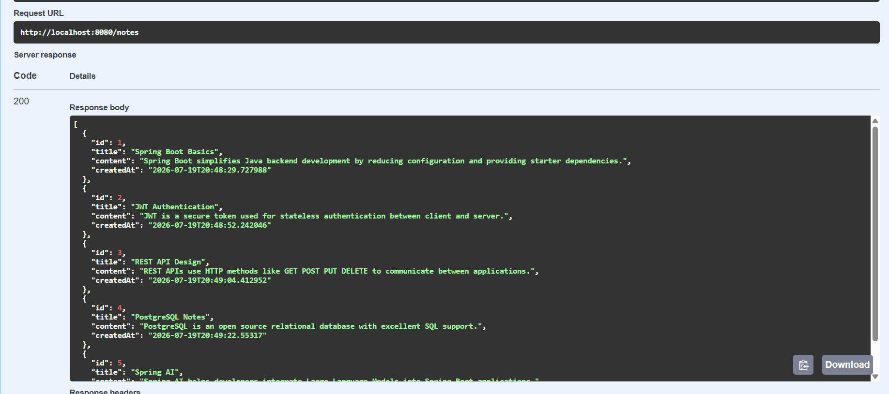

---

## ✏️ Update Note

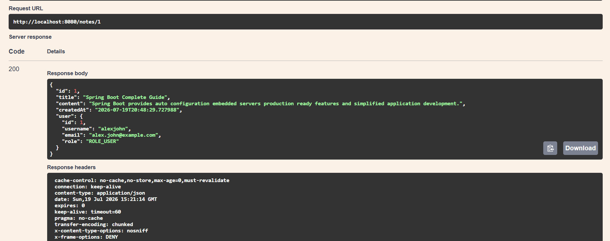

---
## 🔍 Search Notes

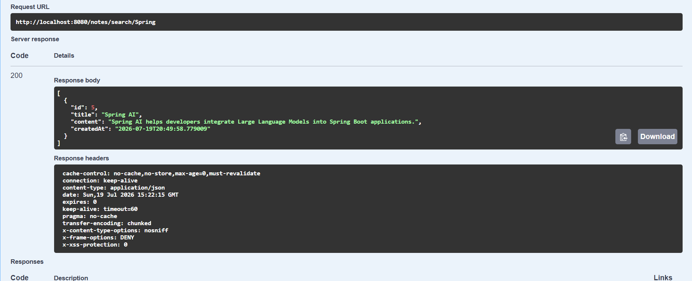

---

## 📄 Pagination

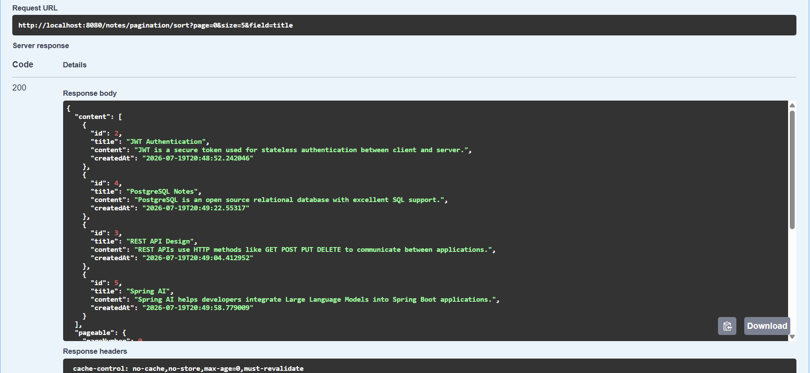

---

## 🔃 Sort Notes

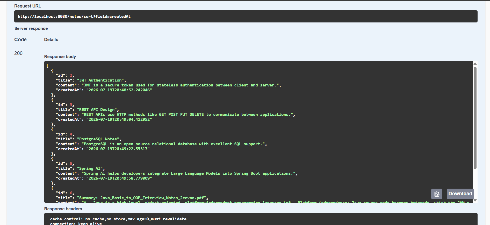

--

## 📥 Download Note as PDF

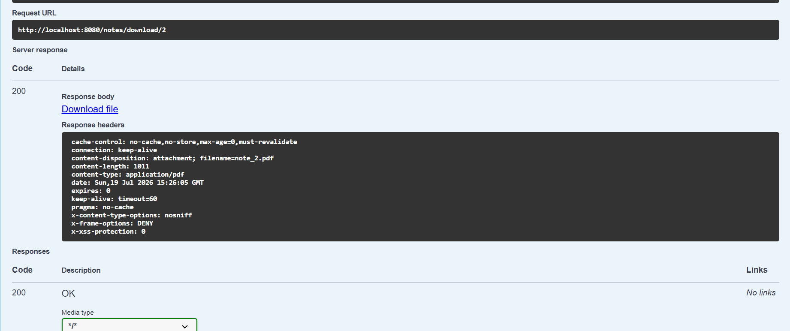

---

## 🤖 AI Title Generation

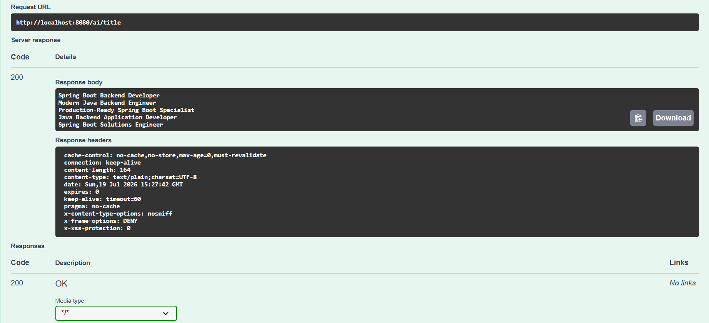

---

## 🧠 AI Custom Prompt Summary

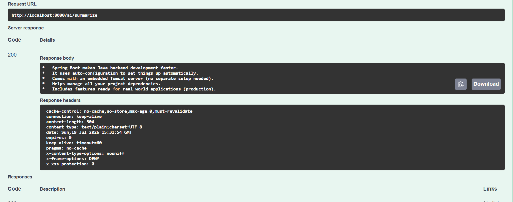

---

## 📄 Upload PDF

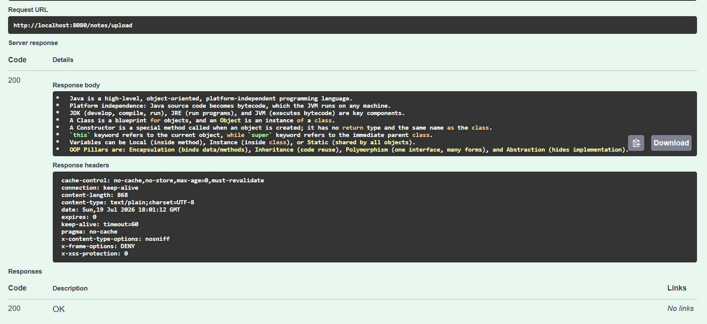

---

## ✨ AI PDF Summary

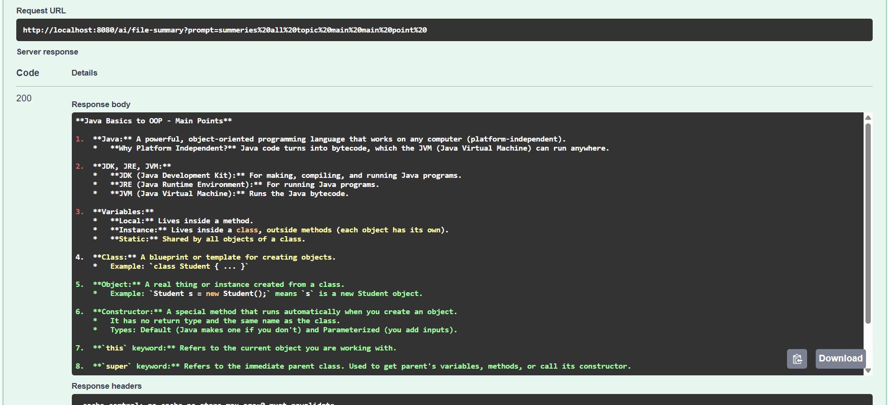

---

## 🏷 AI PDF Title Generation

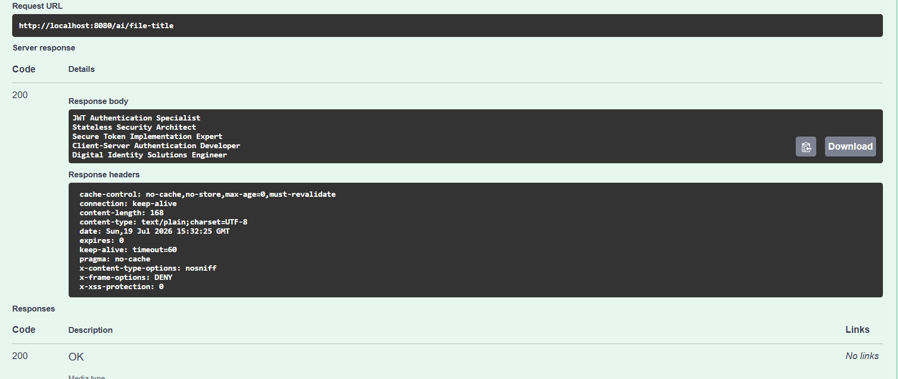

---

## 🔄 Refresh Token

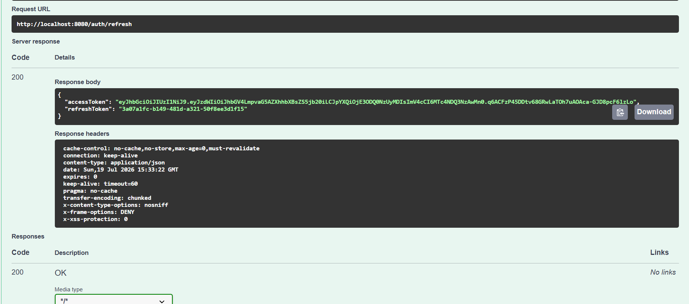

---

## 🚪 Logout


---

## 🗄 PostgreSQL Database

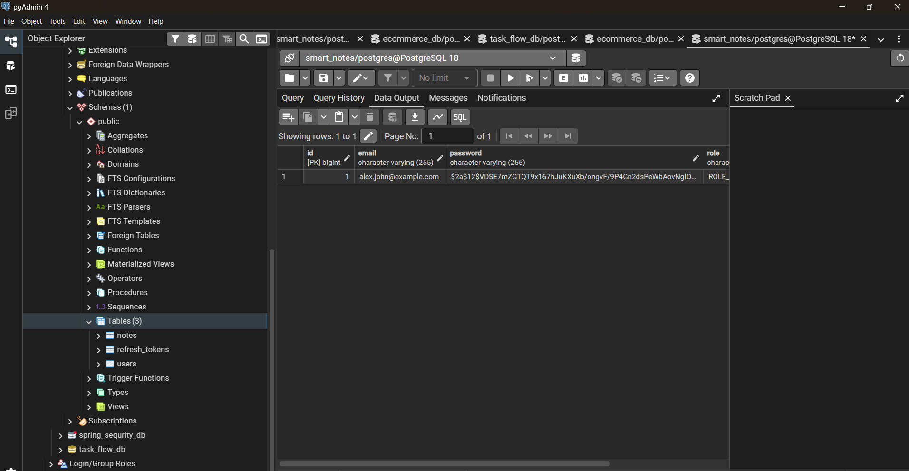

---

# 📚 Learning Outcomes

This project helped me gain practical experience with

- Java 21
- Spring Boot
- Spring Security
- JWT Authentication
- Refresh Token Flow
- Spring AI Integration
- OpenAI Integration
- AI Prompt Engineering
- REST API Development
- PostgreSQL
- Spring Data JPA
- Hibernate
- Maven
- Swagger OpenAPI
- PDF Processing using iText PDF
- Multipart File Upload
- PDF Text Extraction
- Bean Validation
- Exception Handling
- Layered Architecture
- Clean Code Practices

---

# 👨‍💻 Author

## Jeevan Kaware

Java Backend Developer

### GitHub

https://github.com/jeevan-kaware

### Project Repository

https://github.com/jeevan-kaware/smart-notes-api

### LinkedIn

https://www.linkedin.com/in/jeevan-kaware-080643355

### Portfolio

https://smart-portfolio-kappa-eight.vercel.app/

---

# ⭐ If you like this project

If you found this project helpful, please consider giving it a ⭐ on GitHub.

Your support motivates me to build more production-ready Java Backend projects.

---

<div align="center">

# 🚀 Built with Java, Spring Boot, Spring Security, Spring AI, PostgreSQL and ❤️

### Thank you for visiting this repository.

</div>
